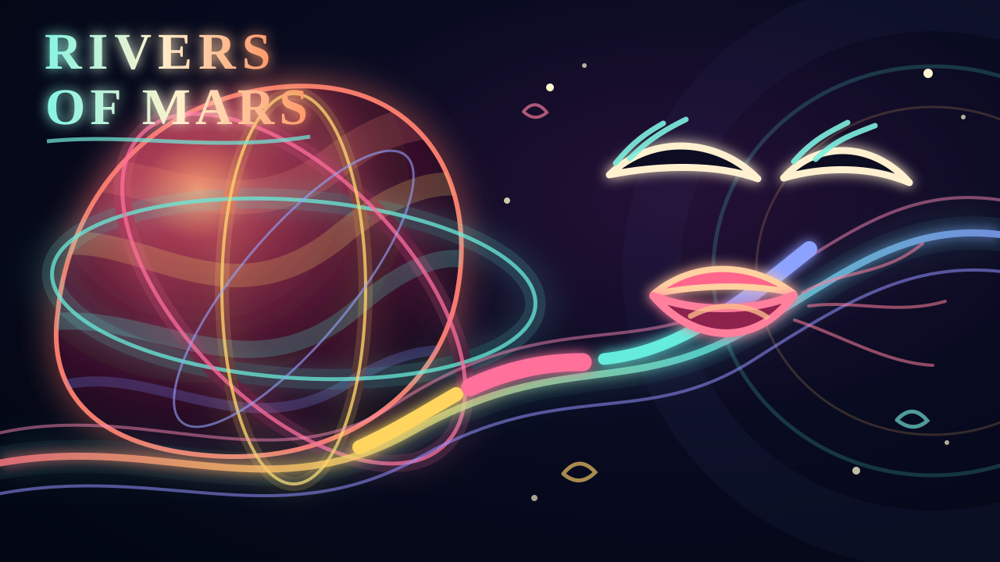

# Music Visualization Toolkit

A dependency-light collection of tools for turning a music project into
frame-accurate animatics, 3D arrangement visualizations, and audio/MIDI-driven
vector performances.

This repository began with reusable code from the **We Be** music-video
project and now includes the completed **Rivers of Mars** narrative-vector
case study. It deliberately does **not** contain the songs, stems, DAW
projects, generated clips, or rendered masters.

## Completed example: Rivers of Mars

[](https://youtu.be/FxzgJe0L55Y)

[Watch **Rivers of Mars** on YouTube](https://youtu.be/FxzgJe0L55Y), or read
the [project notes](projects/rivers-of-mars/README.md).

The project starts with an earlier Bitwig composition, uses the original track
plus human-written lyrics and vocal direction to produce a Suno cover, then
cleans and reworks the separated stems in Bitwig. The completed DAW project
drives a custom timeline register and browser-based vector renderer: stems,
MIDI events, pitch, duration, velocity, rhythm, lyrics, scenes, transitions,
and choreography all remain inspectable inputs rather than being flattened
into a conventional edit decision list. The public video is the durable media
artifact; the repository keeps the code and compact project metadata required
to reproduce it.

## What is here

- **Vector stage** — Three.js laser performers driven by stems, notes,
  automation, lyrics, drum strikes, and tempo-aware section choreography.
- **3D world** — an alternate Three.js arrangement/world visualization.
- **Offline renderer** — deterministic Chromium capture with temporal
  supersampling, ffmpeg encoding, and audio muxing.
- **Musical timing** — closed-form integration of Bitwig DAWproject linear
  tempo ramps, plus a MIDI timing fallback.
- **Music-video pipeline** — shot planning, slates, animatics, prompts,
  generated-clip ingest, and frame-accurate final assembly.
- **Storyboard tools** — prompt work orders, galleries, and a timed storyboard
  animatic.
- **Timeline register** — a project-scoped, bar-primary editor for lyrics,
  overlapping scenes, transitions, choreography, and human/AI notes. Editable
  musical positions compile to deterministic frame edges for renderers; silent
  master/stem waveform references make musical events easy to locate.
- **Narrative vector video** — project-aware illustrated scenes that preserve
  the live browser preview and deterministic, temporally supersampled export
  pipeline while mapping visible actions to DAW-aligned vocal, drum, bass, and
  master envelopes.

The code favors small readable Python scripts, JSON interchange files,
Three.js in the browser, and ffmpeg subprocesses over a large framework.

## Requirements

- Python 3.10+
- ffmpeg and ffprobe
- A Chromium-compatible browser installed by Playwright
- macOS and Windows are tested; system Chrome with D3D11 was used for the
  final `Rivers of Mars` render on Windows

Install the Python environment:

```bash
bash setup.sh
```

## Start a project

1. Add a final mix at `audio/song.wav`.
2. Add a Bitwig `*.dawproject` file under `source/` for exact ramped tempo,
   notes, automation, markers, and stems.
3. If there is no DAWproject, add `midi/song.mid` and use
   `tools/beatmap.py` as the timing fallback.
4. Add bar/beat-marked lyrics at `lyrics/lyrics.md` if needed.
5. Copy and adapt the lightweight files under `examples/we-be-config/`.

For a narrative project, create `projects/<slug>/project.json` and
`timeline.json`, then run `python tools/timeline.py sync
projects/<slug>/project.json`. See [docs/TIMELINE.md](docs/TIMELINE.md).

The vector exporter is currently DAWproject-oriented. A MIDI-only project can
already use the timing, animatic, and shot tools; extending
`tools/stage_export.py` with a MIDI-only substrate is the natural next step.

## Useful commands

```bash
./run.sh timing                  # rebuild and listen to the timing grid
./run.sh timeline rivers-of-mars # open the annotation register/editor
./run.sh timelinesync rivers-of-mars # rebuild its DAW grid + compiled register
./run.sh videopreview             # live illustrated Rivers of Mars scene
./run.sh videodraft               # fast rendered scene with the master audio
./run.sh videotest                # selected scene at final render settings
./run.sh stems                   # extract per-stem spectral envelopes
./run.sh laser                   # export and open the live vector stage
./run.sh laserdraft              # quick full-song staging render
./run.sh lasertest 34 15         # master-quality 15-second test window
./run.sh laserfinal              # 1080p60, 32x temporal master
./run.sh world                   # export and open the alternate 3D world
./run.sh cut                     # render the current shot edit
```

Run tools through the repository environment rather than activating it:

```bash
./.venv/bin/python3 tools/stage_export.py
```

## Data flow

```text
DAWproject / MIDI / mix / lyrics
              |
              v
      timing + musical features
              |
       +------+-------+
       |              |
       v              v
 vector stage      shot plan
       |              |
       v              v
 offline master    animatic / cut
```

Generated data lives in `analysis/`, `stage/data.json`, and `world/data.json`.
Large media and rendered outputs are ignored by Git. Commit code, small
configuration, timing metadata when useful, and documentation—not paid or
regenerable media.

## Lightweight example configuration

`examples/we-be-config/` preserves small shot and world configuration files
from the project that produced this toolkit. They are examples of shape and
structure only; the corresponding audio and images are intentionally absent.

## Repository status

This is an extracted working toolkit rather than a packaged library. Some
tools still assume the directory conventions of the original project. The
scripts are intentionally straightforward so those assumptions are easy to
replace as new music-video projects are added.
