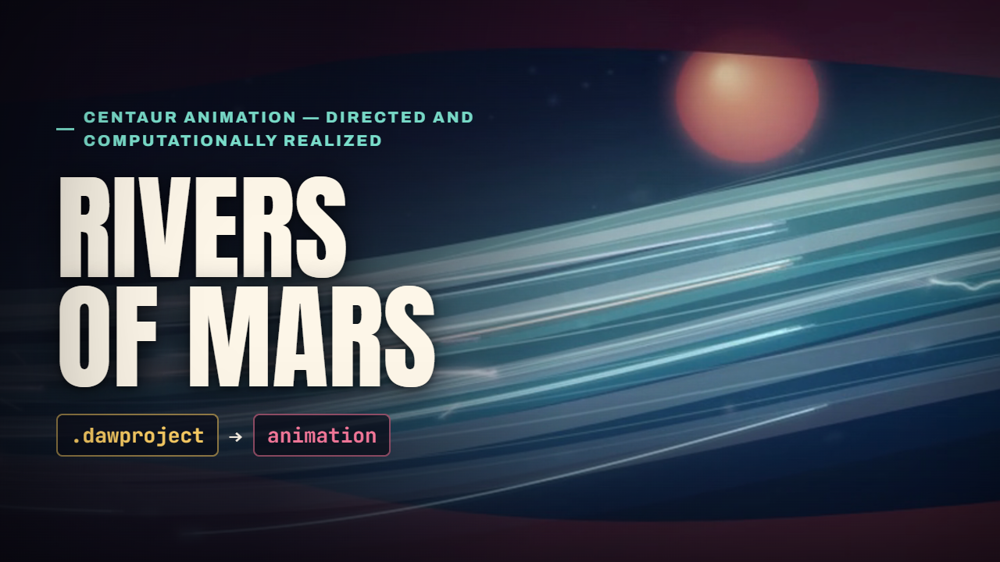
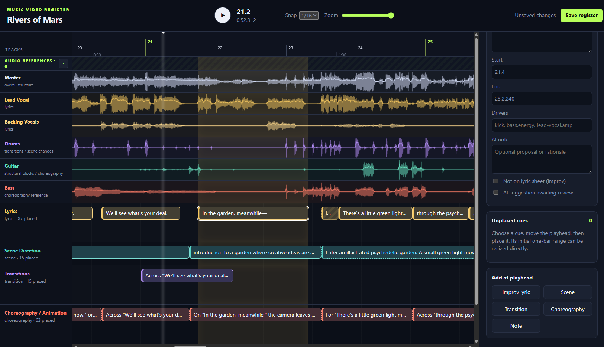

# Rivers of Mars

[](https://youtu.be/FxzgJe0L55Y)

**Status:** complete and [published on YouTube](https://youtu.be/FxzgJe0L55Y).

`Rivers of Mars` is a 3:23 narrative vector music video and the first complete
project built with this repository's music-video register. The public video is
the durable result; source audio, the DAW project, generated substrates, and
rendered media remain machine-local and outside Git.

## Music provenance

The underlying instrumental was composed in Bitwig several years before this
project, without AI. For this cover, the original recording, human-written
lyrics, and musical and vocal-delivery direction were supplied to Suno. Suno
was used primarily for its vocal performances. Its separated stems were then
run through a custom cleanup pipeline and brought back into Bitwig, where parts
were overdubbed, replaced, or augmented with real instruments and task-specific
sounds, including a modeled electric-guitar VST.

The resulting Bitwig DAWproject is the timing and performance source for the
video. The pipeline extracts the master alignment, stem envelopes, exact MIDI
events, and higher-rate performance signals. A purpose-built register aligns
lyrics and stores scene, transition, choreography, and production-note cues in
musical time.

The browser renderer draws original vector scenes from those inputs. Voice
drives faces, drums alter the environment, MIDI pitch/duration/velocity become
colored moving forms, and the authored register controls blocking, camera
movement, transitions, and scene boundaries. The result is scene-directed and
code-rendered; it does not composite the photographic reference or use
generated video footage.

## Music-video register



The register groups silent waveform references above the editable annotation
lanes. Lyrics, scene direction, transitions, choreography, drivers, and review
notes remain aligned in musical positions while the master audio supplies one
shared playback clock. The UI was built for this workflow rather than adapted
from a general-purpose video editor.

## Final project numbers

- Runtime: 203.708 seconds
- Register: 184 timed items across 5 lanes
- Output: 1920×1080, 24 fps, 4,889 frames
- Temporal sampling: 32 samples per frame, 156,448 sampled exposures
- Encoding: H.264 CRF 14 slow, 48 kHz stereo AAC at 320 kbps
- Final render time on the project machine: about 94 minutes

## Key files

- `project.json` — machine-independent project manifest
- `timeline.json` — editable music-video register
- `thumbnail.png` — final project thumbnail
- `../../video/app.js` — narrative vector renderer
- `../../docs/VIDEO.md` — detailed scene, motion, and render design record

## Regenerate

Sync and validate the register first:

```powershell
.\.venv\Scripts\python.exe tools\timeline.py sync projects\rivers-of-mars\project.json
.\.venv\Scripts\python.exe tools\timeline.py validate projects\rivers-of-mars\project.json
```

Start the live timeline or video preview:

```powershell
.\.venv\Scripts\python.exe tools\timeline_server.py --project projects\rivers-of-mars\project.json
```

Then open `http://127.0.0.1:8760/timeline/` for the register or
`http://127.0.0.1:8760/video/` for the live renderer.

Render the published master profile from PowerShell:

```powershell
.\.venv\Scripts\python.exe tools\world_render.py --headless --browser chrome --angle d3d11 --capture cdp --page video --project projects/rivers-of-mars/project.json --from 0 --dur 203.7 --fps 24 --blur 32 --width 1920 --jpeg 0 --crf 14 --preset slow --abr 320k --out out/rivers-of-mars_full-master_1080p24-32x_v1.mp4
```

Large outputs are intentionally ignored. After a project is accepted, keep the
final master, latest full preview, thumbnail exports, and a small set of useful
review stills; discard intermediate probes and scene iterations.
